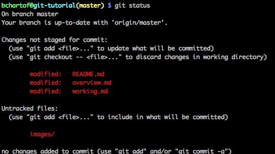

#Our Git Workflow

##Cloning a Repository
(I'm throwing around a lot of git specific terminology here, if you need a refresher you can check out [the overview](overview.md))

1. To clone a repository onto your local computer, first head to the repo's home page (for this lesson, let's clone the [git-tutorial repo](https://github.com/UrbanInstitute/git-tutorial))

2. On the right hand side of the page, find the clone URL, it looks like this:


3. Copy the URL

4. In a new Terminal window, run
```bash
git clone the_url
```
Where `the_url` is replaced with the URL you just copied.

5. In the Terminal, to move into the folder you just cloned (which is automatically named "git-tutorial"), run ```cd git-tutorial```

##Do some work

1. Create, delete, or edit some files or folders. If you find typos etc. in these tutorials, feel free to edit them, but I also made a folder called [workspace](workspace) where you can create and edit files. Maybe make CSS stylesheet, or write a list of instructions on how to make the best turkey sandwich ever. Whatever you want.

2. Now, from inside the `git-tutorial` folder run 
```bash
git status
```
And you should see something that looks similar to this:

This gives you a lot of information, which I'll go through piece by piece.
- `On branch master` means I am working in the main branch, called master. See below for instructions on creating new branches.
- `Your branch is up-to-date with 'origin/master'` means that there are currently no changes ready to be pushed to the remote repo.
- The `Changes not staged for commit` section lists three files that have changed (README.md, overview.md, and working.md) since my last push, but those changes have not been saved in a commit.
- The `Untracked fiels` section lists files or folders that did not exist at the time of my last push, and have been created since then.

3. Before you commit the changes, you need to *add* them to the commit (sort of like putting them on deck). This step is part of the workflow in order to allow you to do a bunch of work, then separate it into a few different commits. For example, say you're working for a few hours on a graphic, in order to make it colorblind compliant. You might add all the files in a `css` folder to one commit, then push it with the commit message "updated stylesheets to satisfy colorblind requirements." Then, you might add the `README.md` file or other documentation files to a new commit, and push it with the message "Documentation now describes colorblind compliance and resources." If that terminology seems way too dense, keep reading, and hopefully things will become clear.

You have a few options on how to add files to a commit.

```bash
git add -A
```
will add all files (the three .md files as well as everything in the `images` folder, in this case) to the commit. The `-A` stands for "all."
**A handy aside: if there are files you never want to add to any commit, you can make a special hidden file inside the repo called `.gitignore`. In the [git-tutorial .gitigore](.gitignore), I tell git never ever to add the OS X file called [.DS_Store](http://en.wikipedia.org/wiki/.DS_Store) that lives in every folder and stores info like file icon positions, as well as any file that ends in .config (which might contain information like passwords that I never want to push to github). With a good .gitignore, you can safely `git add -A` without worrying about accidentally adding files that shouldn't be committed**

```bash
git add *.md
```
will add any files that end in ".md" to the commit. In this example, this would add README.md, overview.md, and working.md.

```bash
git add README.md
```
will add just one file, README.md, to the commit.

4. Next, you need to commit the files (it's confusing that "commit" is both a verb and a noun. Really, you're "committing(v) the commit(n)" Ugh!) All commits should be described by a *commit message* that describes the changes you made, as a whole. Here's a simple example of a commit to git-tutorial, viewed on github.com:

Note a few things. The commit message is "Example typo commit", which tells us that I (bchartoff) made the commit in order to show you an example of a simple commit to fix a typo. README.md has been changed, and github highlights lines with deletions in red (on the left), with the specific deleted characters in darker red. Added lines/ characters are shown in green on the right.

The page for this commit is [here](https://github.com/UrbanInstitute/git-tutorial/commit/a7fc4bef6dde493c62fd60229ed2ebc9ef20ca14), or you can click on  at the top of the repo's main page (the number will be different of course).